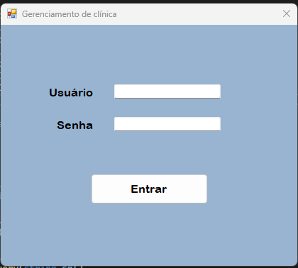
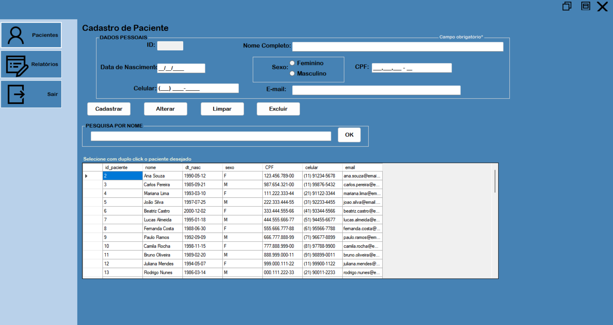
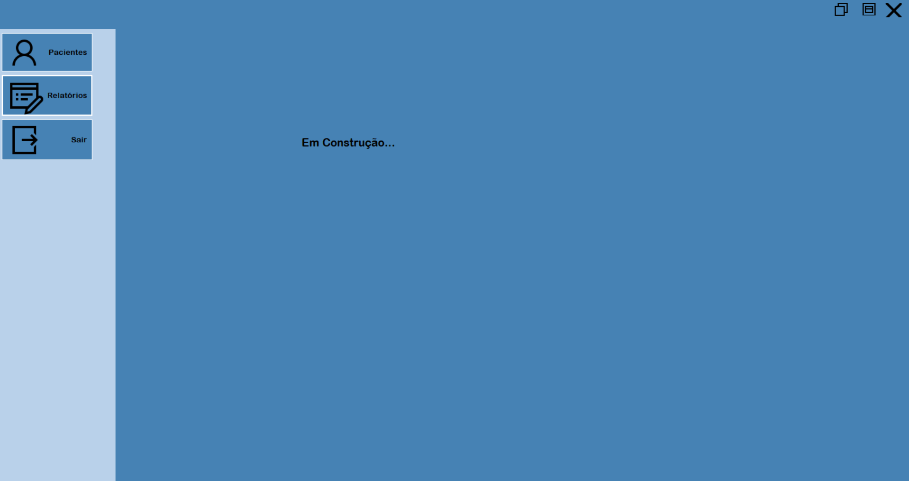

# 🏥 Sistema de Gerenciamento de Clínica Médica

Este projeto é um sistema de gerenciamento desenvolvido em **C# com interface gráfica (Windows Forms)**.  
O sistema possui autenticação para **administradores** e permite realizar o **CRUD completo** (Cadastrar, Alterar, Excluir e Pesquisar) de pacientes, além de exibir **relatórios** e permitir o **logout** seguro.

---

## ⚙️ Funcionalidades

- 🔐 **Login de Administrador**
- 🧾 **Cadastro de Pacientes**
- ✏️ **Alteração de Dados**
- ❌ **Exclusão de Pacientes**
- 🔍 **Pesquisa por Nome**
- 📊 **Relatórios**
- 🚪 **Encerrar Sessão (Logout)**

---

## 🖼️ Interface do Sistema

> Aqui você pode colocar as imagens das suas telas.  
> Basta criar uma pasta chamada `imagens` no repositório e colocar os prints lá.

### Tela de Login


### Tela de Cadastro de Pacientes


### Tela de Relatórios


---

## 🧰 Tecnologias Utilizadas

- 💻 **Linguagem:** C#  
- 🖥️ **Ambiente:** Visual Studio  
- 🗄️ **Banco de Dados:** MySQL  
- 🔗 **Conexão:** MySQL Connector for .NET  

---

## 🚀 Como Executar o Projeto

1. **Clone o repositório:**
   ```bash
   git clone https://github.com/seu-usuario/seu-repositorio.git
